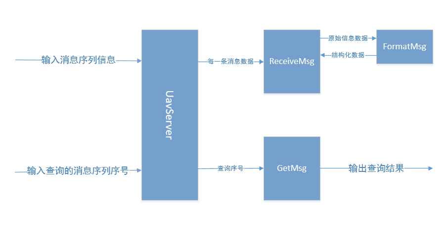
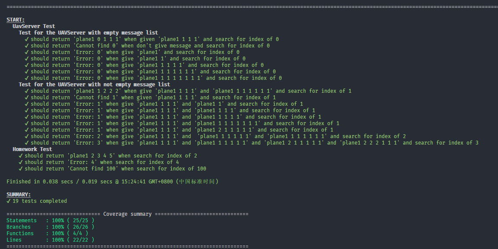

# HOMEWORK 无人机

> 本文档主要从设计思路和单元测试两个方面进行讲述

------

### 设计思路

> 简述题目要求：
>
> 1. 无人机第一次进入监控区域的时候，发送的消息格式为` {无人机ID} {X} {Y} {Z}`，其他格式为错误
> 2. 当无人机以及发送了消息后，继续发送的消息格式为` {无人机ID} {X'} {Y'} {Z'} {offsetX} {offsetY} {offsetZ}`，其他格式为错误
> 3. 一旦无人机为故障状态，无论发送什么消息，无人机都被判定为故障状态
> 4. 输入为记录无人机数据的文本文件或者文本内容以及查询序号
> 5. 输出为查询结果

根据题目的要求，我们可以知道，不管是用户输入文本内容还是读取文本文件都是使用系统提供的方法，这些都是确定不会出错的，而主要的会出现错误的地方是在于对数据的处理和返回查询结果的部分。

程序包含一个名为`UavServer`的类，这个类主要包含一个存放接收到的消息序列的数组`msgList`，以及两个功能：`ReceiveMsg` 和`GetMsg`。

ReceiveMsg`功能介绍：

1. 输入为一条无人机消息序列`msg`
2. 没有输出
3. 内部包含一个方法`FormatMsg`
   1. 输入是消息序列`msg`
   2. 输出是结构化`{name:name,lastPos:[],offset:[],curPos:[],error:error}`形式的数据
   3. 主要的作用是对消息的结构化处理
4. 主要的作用是得到结构化的数据，然后结合数据序列数组`msgList`和当前的数据判断无人机的状态，并修改状态，然后存入`msgList`

`GetMsg`功能介绍：

1. 输入为消息序号`index`
2. 输出为数据查询结果
3. 主要的作用是结合数据序列数组`msgList`和要查询的消息序号`index`进行查询，然后返回查询结果

Tasking图：

-----

### 单元测试

单元测试环境为`karma+jasmine+mocha-reporter+coverage`

测试主要分为两个部分，一个是**针对功能的各种情况的测试**，另一个是**针对题目要求的测试**；**针对题目要求的测试**主要是检查要求是否符合题目要求的结果，这个不做展开；下面主要**针对功能的各种情况的测试**进行说明。

**针对功能的各种情况的测试**由于第一次数据和之后的数据格式是不一样的，所以又分为消息序列`msgList`为空时的测试和消息序列`msgList`为不为空时的测试。

消息序列`msgList`为空时的测试：

* 传入一条正确的消息格式，查看序列为0的结果，测试输出结果是否为正确格式
* 不传入数据，查看序列为0的结果，测试输出结果是否为`Cannot find`
* 传入一条正确的消息格式，查看序列为1的结果，测试输出结果是否为`Cannot find`
* 传入一条错误的消息格式，查看序列为0的结果，测试输出结果是否为`Error:`,错误格式包括缺位,多位以及刚好为第二条消息序列的正确格式等等

消息序列`msgList`不为空时的测试：
* **初始已包含一个正确格式的消息序列**
* 传入一条正确的消息格式，查看序列为1的结果，测试输出结果是否为正确格式
* 不传入数据，查看序列为1的结果，测试输出结果是否为`Cannot find`
* 传入一条错误的消息格式，查看序列为1的结果，测试输出结果是否为`Error:`,错误格式包括缺位,多位以及刚好为第一条消息序列的正确格式等等
* 传入一条正确的消息格式，但是坐标不正确，查看序列为1的结果，测试输出结果是否为`Error:`
* 传入一条错误的消息格式然后传入一条正确的消息格式，查看序列为2的结果，测试输出结果是否为`Error:`
* 传入一条错误的消息格式然后传入两条正确的消息格式，查看序列为3的结果，测试输出结果是否为`Error:`

单元测试结果：

-----

*本文结束！！！*